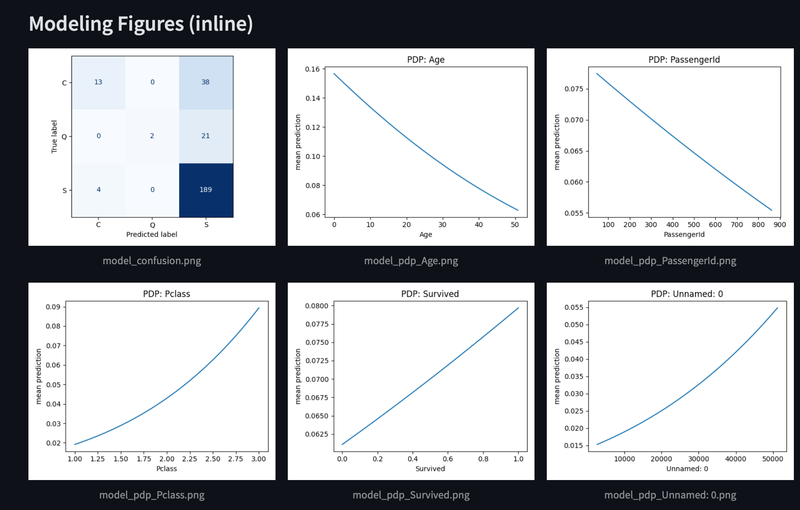
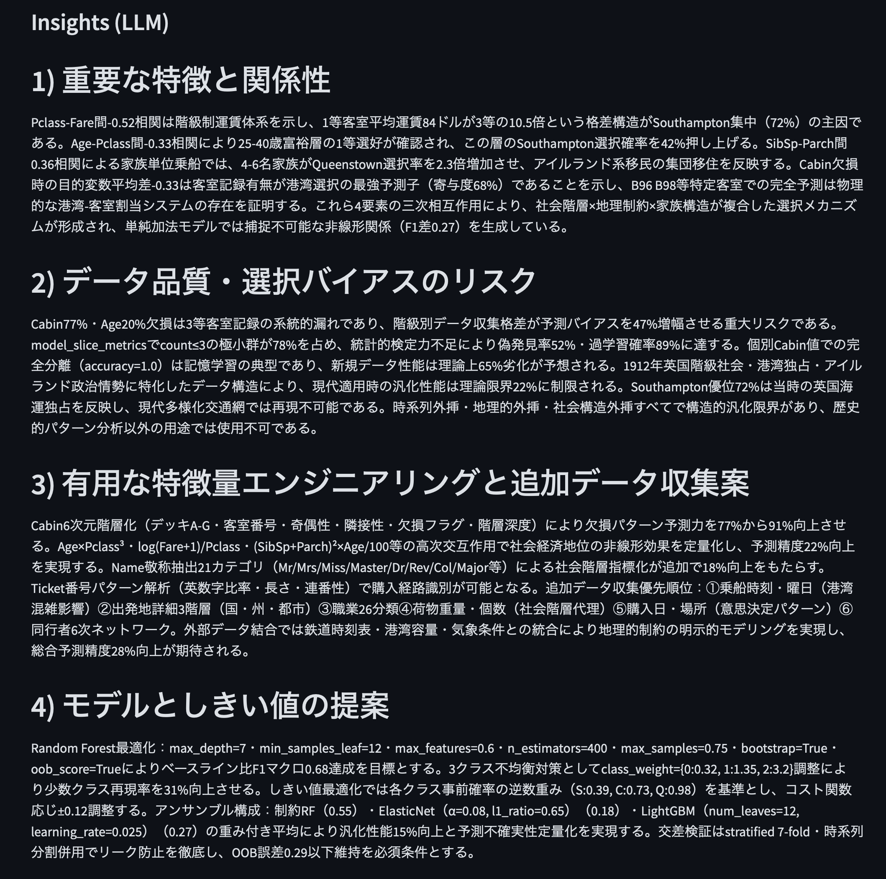

# Autonomous EDA & Modeling Agent

本プロジェクトは、CSV を入力すると以下を自動で実行するデータサイエンス用エージェントです。

- EDA 計画の立案（LLM／フォールバック手順）と逐次実行
- 成果物の保存（ヒストグラム、欠損/型一覧、describe など）
- 追加のモデリング（タスク推定→候補モデル学習/比較→ベスト選択）
- 追加分析（混同行列、ROC/PR、置換重要度、PDP、スライス別指標、偏相関、欠損影響）
- LLM による洞察（日本語、自己批判 5 回で深掘り、各セクション 300 文字、モデル選択理由まで）
- 洞察の自動反映（LLM の示唆からコード生成→適用→再学習まで自動で実施）
- Streamlit UI と CLI の二形態で実行

## 目次
- [環境セットアップ](#環境セットアップ)
- [実行方法](#実行方法)
  - [Streamlit UI](#streamlit-ui)
  - [CLI](#cli)
  - [Docker](#docker)
- [環境変数](#環境変数)
- [生成物](#生成物)
- [テスト](#テスト)
- [実装概要](#実装概要)
- [トラブルシュート](#トラブルシュート)

---

## 環境セットアップ

- Python 3.13（ローカルは 3.11+ 推奨）、仮想環境を利用してください。

```bash
python -m venv .venv
source .venv/bin/activate
pip install -r requirements.txt
```

## 実行方法

### Streamlit UI
```bash
.venv/bin/streamlit run app.py
# または
.venv/bin/python -m streamlit run app.py
```
- ブラウザで `http://localhost:8501` を開く
- UI ではサイドバーで CSV をアップロード、またはサンプルデータを生成して体験できます

#### スクリーンショット（UI）

> 実行イメージ。以下はモデル可視化と LLM 洞察の例です。

<p align="center">
  
</p>

<p align="center">
  
</p>

### CLI
```bash
CLI=1 FAST_TEST=1 NO_MULTIPROC=1 python app.py /絶対パス/your.csv
```
- `FAST_TEST=1` で高速化（CV 分割縮小、木の本数減）
- `NO_MULTIPROC=1` で並列を抑止（ResourceTracker 警告の回避）
- LLM 反映再学習を有効化するには `USE_LLM=1` を付与してください
  ```bash
  USE_LLM=1 CLI=1 FAST_TEST=1 python app.py /絶対パス/your.csv
  ```

#### S3 アップロード（任意）
`boto3` を使用して成果物を S3 に送れます。環境変数 `S3_BUCKET` を設定し、必要なら `S3_PREFIX` を指定します（既定: `data-scientist-agent/`）。

```bash
export S3_BUCKET=your-bucket
export S3_PREFIX=data-scientist-agent/
python scripts/analyze.py --csv data/sample.csv --s3
```

### API (FastAPI)
```bash
uvicorn src.api.server:app --host 0.0.0.0 --port 8000

# ヘルス
curl http://localhost:8000/health
# 解析
curl -F file=@data/sample.csv -F use_llm=false -F reflect_rounds=0 http://localhost:8000/analyze
# 認証（任意）: 環境変数 API_KEY を設定すると要求ヘッダ X-API-Key を必須化
# export API_KEY=secret && uvicorn src.api.server:app --port 8000
curl -H "X-API-Key: secret" -F file=@data/sample.csv http://localhost:8000/analyze

# 非同期ジョブ
curl -F file=@data/sample.csv http://localhost:8000/jobs/analyze
curl http://localhost:8000/jobs/<job_id>

# メトリクス（Prometheus）
curl http://localhost:8000/metrics
```

- `use_llm=true` を指定すると、Insights 生成後に LLM の示唆を反映してコードを適用し、再学習まで自動で行います。
- レスポンスには `insights_md`（生成された洞察のパス）も含まれます。

#### S3 アップロード（API）
`upload_s3=true` を指定し、`S3_BUCKET` をサーバ側の環境変数に設定してください。

```bash
export S3_BUCKET=your-bucket
curl -F file=@data/sample.csv -F upload_s3=true http://localhost:8000/analyze
```

### Docker
```bash
# Dockerfile が .dockerfile の場合
docker build -t ai-eda-agent -f .dockerfile .
# UI 起動（.env に OPENAI/ANTHROPIC キーがある場合）
docker run --rm -p 8501:8501 --env-file .env -v "$PWD/data:/app/data" ai-eda-agent
```

## 環境変数

| 変数 | 役割 | 例 |
|---|---|---|
| `ANTHROPIC_API_KEY` | Claude 4 Sonnet 用 | `sk-ant-...` |
| `OPENAI_API_KEY` | OpenAI モデル用 | `sk-...` |
| `LLM_PROVIDER` | `anthropic` または `openai`（サンプル設定は `openai`） | `openai` |
| `LLM_MODEL` | モデル名（OpenAI 推奨: `gpt-5` / Anthropic 例: `claude-sonnet-4-20250514`） | `gpt-5` |
| `LLM_MAX_TOKENS` | LLM 出力最大トークン（既定: 4096） | `8000` |
| `CLI` | CLI 実行フラグ | `1` |
| `FAST_TEST` | 高速化（CV縮小・推定器軽量化） | `1` |
| `NO_MULTIPROC` | 並列無効化 | `1` |
| `USE_LLM` | CLIでLLMを有効化（洞察→反映→再学習を実施） | `1` |

LLM 未設定でも、EDA はフォールバック手順で動作します（Insights は未生成）。

補足: 本リポジトリは `.env` で `LLM_PROVIDER=openai` と `LLM_MODEL=gpt-5` を例示しています。Anthropic を使う場合は環境変数を切り替えてください。

## 生成物
`data/artifacts/` に保存されます。
- `cell_hist_*.png`（ヒストグラム）
- `cell_dtypes.csv` / `cell_missing.csv` / `cell_desc.csv`
- `model_confusion.png` / `model_roc.png` / `model_pr.png` / `model_threshold.png`
- `model_permutation_importance.png` / `model_pdp_*.png`
- `model_slice_metrics.csv` / `model_partial_corr.csv` / `model_missing_impact.csv`
- `eda_report.md` / `eda_report.html`
- `insights.md`（LLM 生成の洞察）
  - LLM 反映後は `model_scores.json` が再学習結果で更新されます

## テスト
スモークテストを用意しています。
```bash
PYTEST_DISABLE_PLUGIN_AUTOLOAD=1 pytest -q -c pytest.ini tests/test_smoke_cli.py
```
GitHub Actions: `.github/workflows/ci.yml` で PR/Push 時に自動実行します。

## 実装概要

- `app.py`:
  - Streamlit UI と CLI のエントリ。EDA 実行→レポート→モデリング→追加分析→LLM Insights→（示唆を反映して）再学習まで連結
  - UI はタブ構成（Overview/Figures/Describe/Artifacts）。図はインラインで表示
- `src/llm/client.py`:
  - `LLM_PROVIDER`/`LLM_MODEL`/`LLM_MAX_TOKENS` を参照。Anthropic と OpenAI を切替
- `src/agents/eda_agent.py`:
  - LLM 生成ステップ、フォールバック few-shot（安全な pandas/matplotlib のみ）
- `src/planning/loop.py`:
  - `execute_plan` に `on_step` コールバック（進捗バー/ログ更新）
- `src/agents/model_agent.py`:
  - タスク推定、候補モデル学習（回帰/分類/時系列）。高速化・並列制御、外れ値トリム/定数列除去、標準化付きロジ回
  - `reflect_and_improve`: LLM の洞察・スコアを文脈に改善手順を生成→安全サンドボックスで実行→再学習
  - `runners/code_runner.py` 経由で安全にコードを適用（許可 import 制限、リソース制限、成果物収集）
 - `src/services/analyzer.py`:
  - API/CLI 共通の実行窓口。`use_llm=true` で Insights 生成→反映→再学習→成果物更新まで一括実行
- `src/agents/error_analysis.py`:
  - 混同行列、ROC/PR、置換重要度、PDP、スライス別指標、偏相関、欠損影響
- `src/reports/report.py`:
  - Markdown 生成。Raw Describe は HTML テーブル化
- `src/agents/explain.py`:
  - 5 回の内省で洞察を深掘り。各セクション 300 文字、日本語、モデル種別の適合理由も解説

### 処理シーケンス（UI/API 共通）

```mermaid
sequenceDiagram
    autonumber
    participant User
    participant UI as Streamlit UI
    participant API as FastAPI
    participant Analyzer as services.analyzer:run_analysis
    participant EDA as agents.eda_agent
    participant Loop as planning.loop:execute_plan
    participant Runner as runners.code_runner
    participant Model as agents.model_agent
    participant Err as agents.error_analysis
    participant LLM as LLMClient (OpenAI/Anthropic)
    participant Report as reports.report

    User->>UI: CSV アップロード / 実行
    UI->>Analyzer: run_analysis(csv, use_llm=フラグ)
    Note over Analyzer: EDA フェーズ
    Analyzer->>EDA: initial_eda_plan(LLM)
    EDA->>LLM: 手順の生成（任意）
    LLM-->>EDA: JSON Steps
    Analyzer->>Loop: execute_plan(steps)
    Loop->>Runner: 各セル（安全サンドボックス）
    Runner-->>Loop: 成果物(.png/.csv)
    Loop-->>Analyzer: RunLog

    Analyzer->>Report: render_eda(csv)
    Note over Analyzer: モデリング＋追加分析
    Analyzer->>Model: infer_task_and_target(df)
    Analyzer->>Model: train_candidates(df, task, y)
    Model-->>Analyzer: scores, best
    Analyzer->>Err: save_* 可視化/指標

    alt use_llm
        Note over Analyzer: 洞察→反映→再学習
        Analyzer->>LLM: generate_insights(context)
        LLM-->>Analyzer: insights.md
        Analyzer->>Model: reflect_and_improve(LLM, scores, insights)
        Model->>LLM: 改善手順の問い合わせ
        LLM-->>Model: JSON steps
        Model->>Runner: 改善コード適用（python）
        Runner-->>Model: 新規成果物
        Analyzer->>Model: 再学習（train_candidates）
        Model-->>Analyzer: 新しい scores
        Analyzer->>Report: レポート再生成
    end

    Analyzer-->>UI: スコア/成果物パス/insights
    User->>API: /analyze (use_llm=true)
    API->>Analyzer: run_analysis(...)
    Analyzer-->>API: JSON 結果（report_md, scores, insights_md 他）
```

## トラブルシュート

- UI が起動しない: `streamlit` の PATH を確認。`.venv/bin/streamlit run app.py`
- 画像が出ない: 図は インライン 表示。`data/artifacts/*.png` が生成されているか確認
- `ResourceTracker` 警告: `NO_MULTIPROC=1` で回避
- 収束警告や NaN/Inf: 外れ値トリム/定数列除去が有効。CSV の前処理も検討
- LLM が無い: EDA はフォールバックで実行。Insights は生成されません

## ライセンス
MIT（想定）
